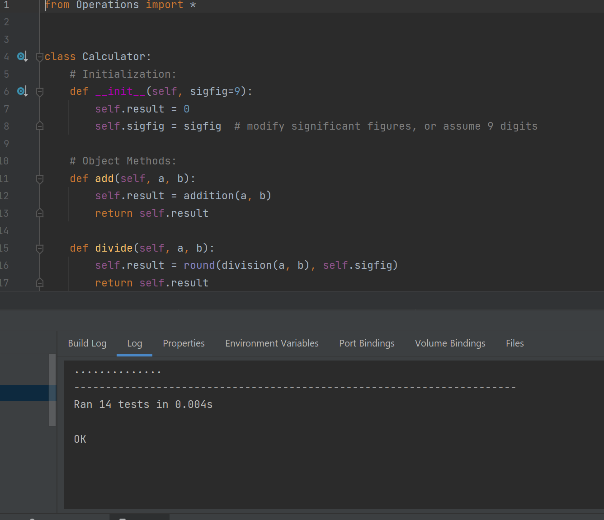

# My Project 2 description
A Test Driven Python Statistical Calculator

## Project overview
This was a calculator application built using Test Driven Development.

The `Calculator` class performs a number of mathematical operations.

The `StatsCalculator` class extends the original `Calculator` to perform more mathematical operations.

The `TestCalculator` class then tests each operation against a known set of inputs/outputs contained in the files located 
in the `/csv` folder, where the `CsvReader` class parses each file to derive test cases.

The test filepaths are provided in the `TestProperties` class.

## Screenshot(s)

